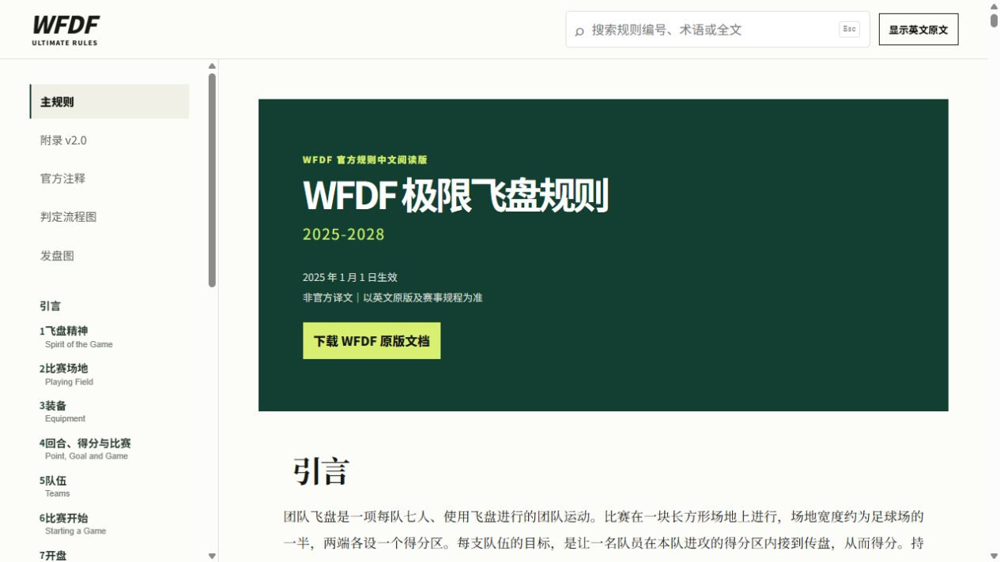
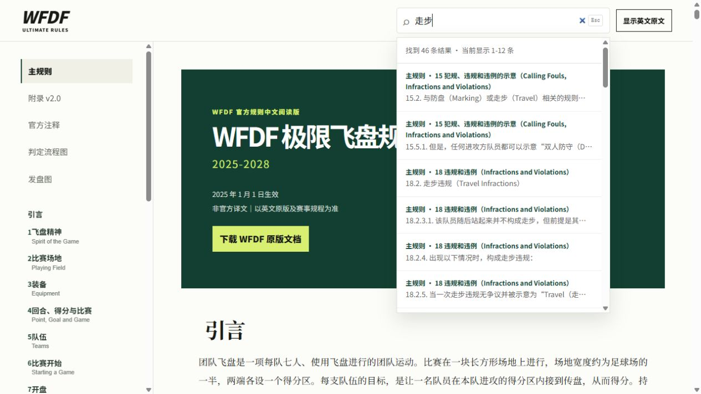
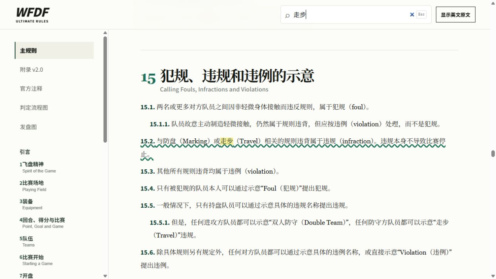
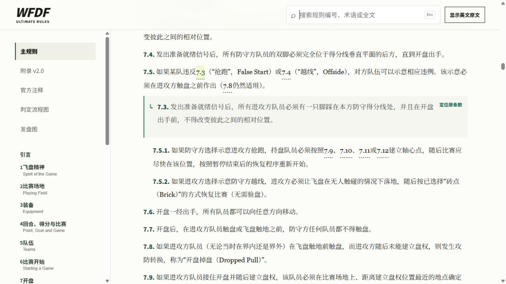
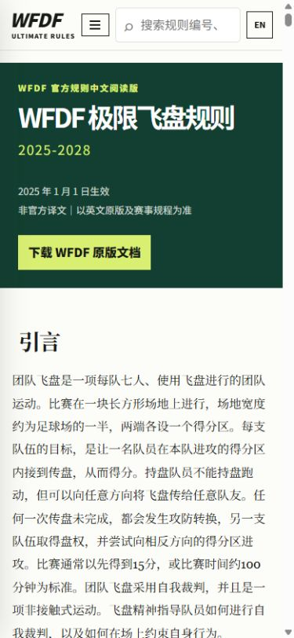
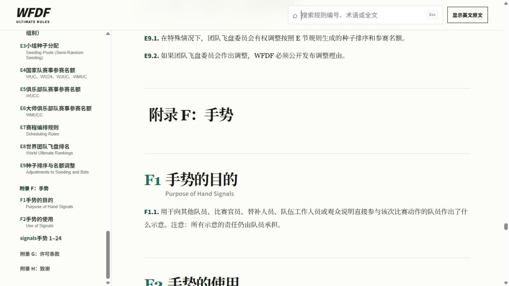

# WFDF 极限飞盘规则 2025–2028 中文查询站

面向中文读者的 WFDF 极限飞盘规则静态查询站。项目整理并呈现 2025–2028 版主规则、附录 v2.0、官方注释及配套图示，适合队员、教练、赛事组织者和规则学习者快速查阅。

[在线访问](https://hooooyu.github.io/frisbee-rules-manual/) · [WFDF 官方原版资料](https://rules.wfdf.sport/resources/)

> 本项目为非官方中文阅读版。正式比赛请以赛事公布的适用版本、WFDF 英文原版及现场裁量为准。



## 主要功能

- **五类规则资料统一阅读**：覆盖主规则、附录 v2.0、官方注释、判定流程图和发盘图，无需在多个文件之间反复切换。
- **跨文档全文搜索**：可按规则编号、中文术语、英文术语或正文内容检索，并直接定位到命中的条款。
- **中英文对照**：正文可切换显示英文原文，判定流程图和发盘图可切换查看 WFDF 英文原图。
- **规则引用联动**：正文中的规则编号可展开相关条款摘要，并可一键跳转到原条款位置。
- **图示化阅读**：内置场地图、判定流程图、发盘图及 24 个标准手势；图片支持点击放大。
- **清晰的规则层级**：保留原规则编号和章节结构，侧栏目录可快速定位；表格内容以适合阅读的形式呈现。
- **阅读体验优化**：适配桌面端和移动端，支持键盘操作，并在同一会话中恢复上次阅读位置。
- **纯静态部署**：网站不依赖后端服务，可直接打开，也可通过 GitHub Pages 自动部署。

## 功能预览

### 全文搜索

搜索结果同时覆盖主规则、附录、官方注释和图示说明，显示来源章节及匹配内容。



### 搜索定位与高亮

点击搜索结果后，页面会自动定位到对应条款，并高亮命中的关键词，便于快速确认上下文。



### 规则引用原位展开

点击正文中的规则编号，可在当前阅读位置直接展开被引用条款；需要查看更多上下文时，也可继续定位到原条款位置。



### 移动端阅读

手机屏幕下会自动收起侧栏，并保留目录、搜索和中英文切换入口，正文按单栏排版展示。



### 标准手势图集

附录收录 24 个 WFDF 标准手势及中英文名称、动作说明，便于场上快速确认。



## 本地运行

项目为无前端构建依赖的静态网站。在仓库根目录运行：

```bash
python -m http.server 8000 -d web
```

然后访问 `http://localhost:8000`。也可以直接打开 `web/index.html` 阅读。

## 更新网页数据

`docs/` 是规则源资料目录。修改中文校订稿、英文 PDF、规则引用编号校订说明或图示素材后，在仓库根目录运行：

```bash
python -m pip install pymupdf
python tools/build_reviewed_web.py
```

校订版构建入口会基于 `build_web_handbook.py` 重新生成 `web/data.js` 及相关网页图片，同时应用已确认的中文章节术语，并将 `docs/官方注释_规则引用编号校订说明.md` 中的完整校订声明与 23 处编号差异表放在官方注释引言之前。官方注释 Markdown 源稿中的目录继续保留在文档中，但网页使用侧栏目录导航，不再把目录重复渲染成正文内容。请勿直接把生成物作为规则源文档编辑。

## 目录结构

```text
.
├── docs/                       # 中文校订稿、英文原版 PDF、图示素材与勘误记录
│   └── 官方注释_规则引用编号校订说明.md
├── tools/                      # 素材提取工具与校订版网页构建入口
│   └── build_reviewed_web.py
├── web/                        # 可直接部署的静态网站
├── build_source_documents.py
└── build_web_handbook.py       # 基础网页数据与图片生成脚本
```

## 资料来源与许可

规则内容来源于 World Flying Disc Federation 发布的《WFDF Rules of Ultimate 2025–2028》及相关文档。WFDF 原文采用 [CC BY 4.0](https://creativecommons.org/licenses/by/4.0/deed.zh-hans) 许可；使用或再发布相关内容时，请保留来源、作者和许可信息。
