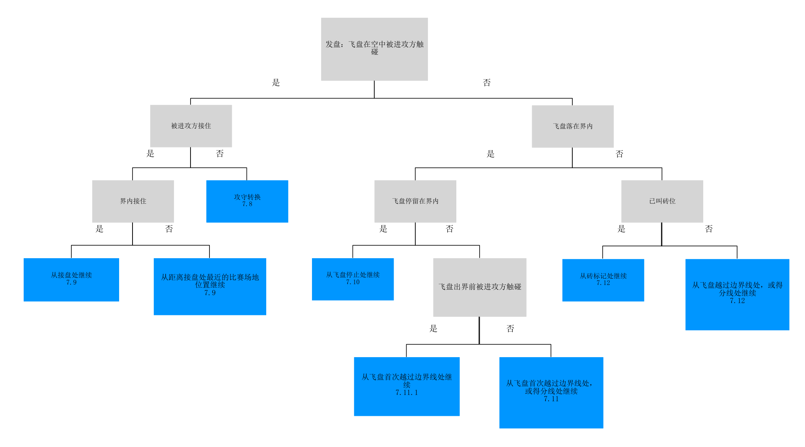
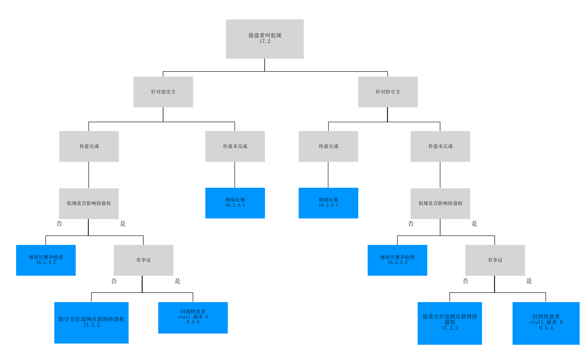
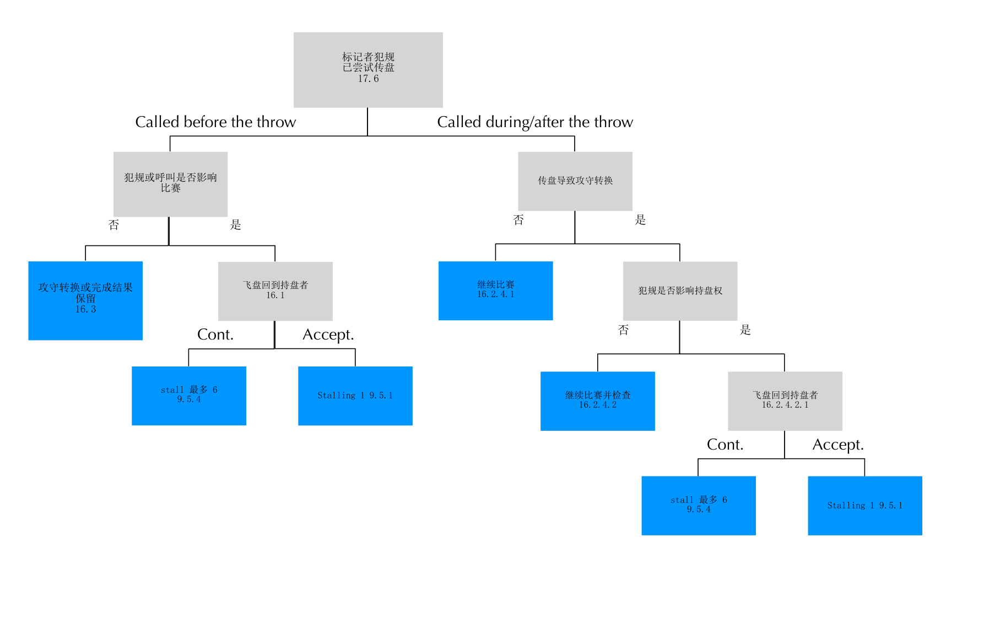
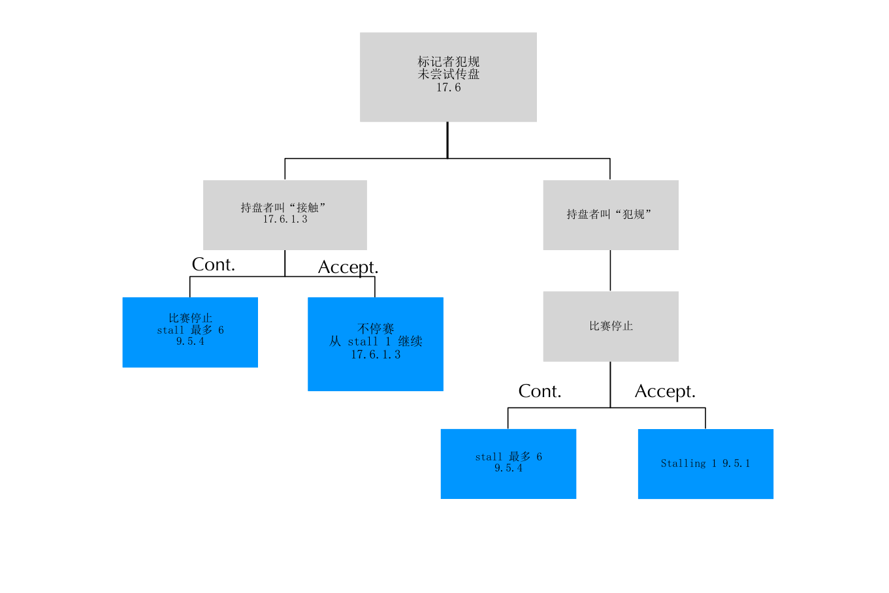
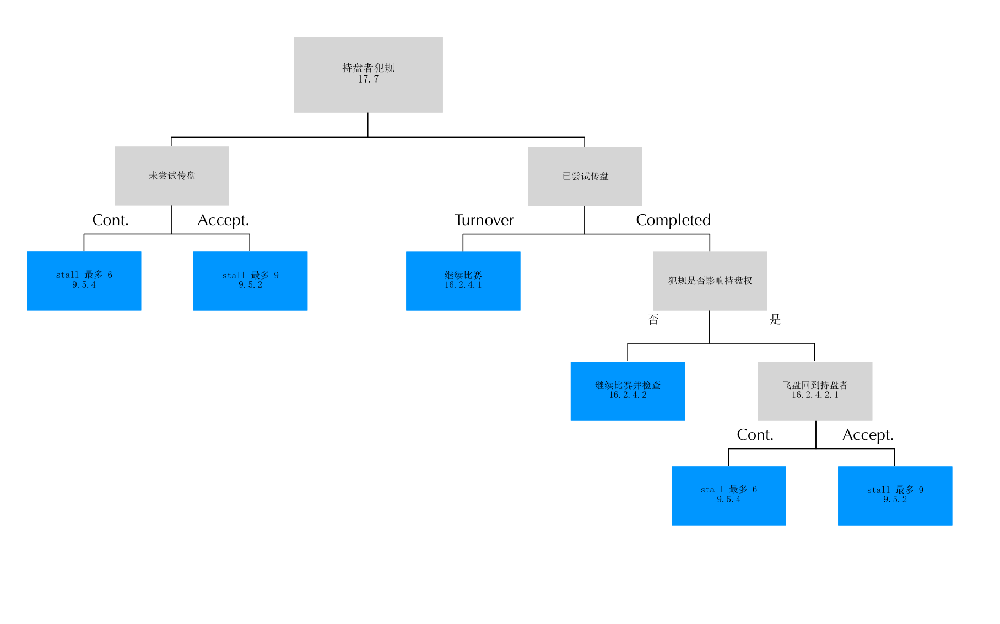
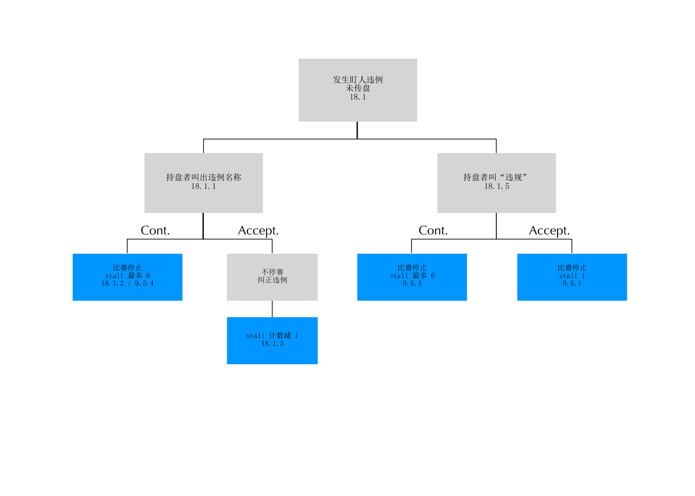
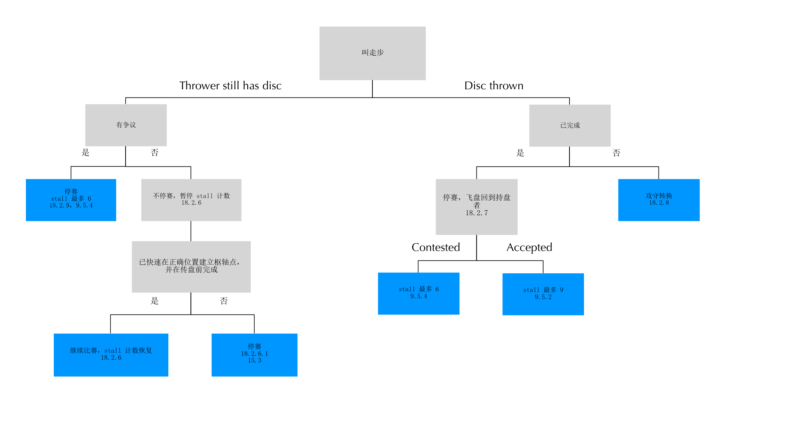
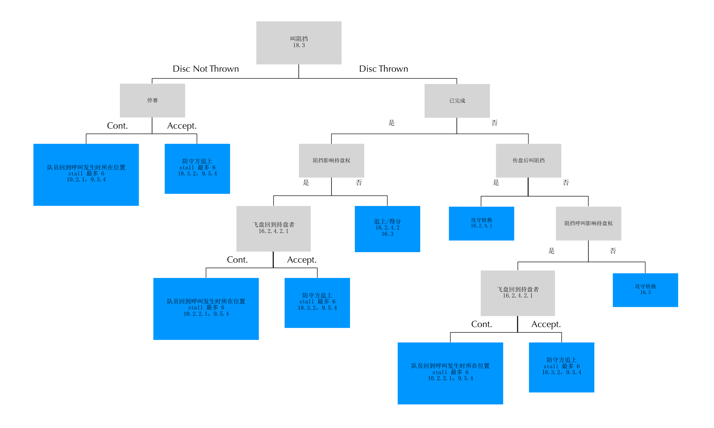

# WFDF 极限飞盘规则 2025-2028 - 判定流程图（中文转写）

> 本文件是网页中文图示的可维护 Markdown 源稿。网页构建直接使用其中的本地 PNG 素材。

## 图 1：发盘落点判定

根据飞盘是否被触碰、是否落在界内或出界，以及是否叫砖位，确认恢复比赛的枢轴位置。

## 图 2：接盘者犯规

接盘者叫犯规后的完成、攻守转换与回传持盘者判定。

## 图 3：标记者犯规：已传盘

标记者犯规且已尝试传盘时，依据是否影响比赛决定继续或检查。

## 图 4：标记者犯规：未传盘

标记者犯规且未尝试传盘时的比赛状态与 stall 计数恢复。

## 图 5：持盘者犯规

持盘者犯规后的继续比赛、回传及 stall 计数判定。

## 图 6：盯人违例

盯人违例和持盘者呼叫违规时的纠正与停赛程序。

## 图 7：走步

走步呼叫后的枢轴点纠正、传盘结果与 stall 计数处理。

## 图 8：阻挡

阻挡呼叫是否影响比赛、队员回位与继续比赛的判定。

