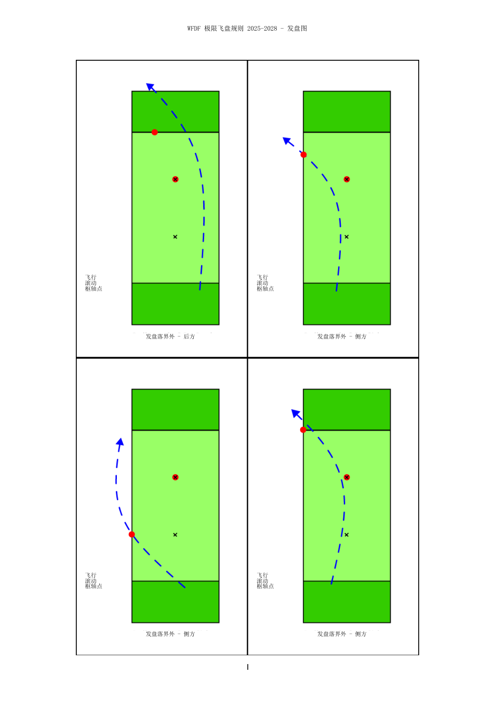
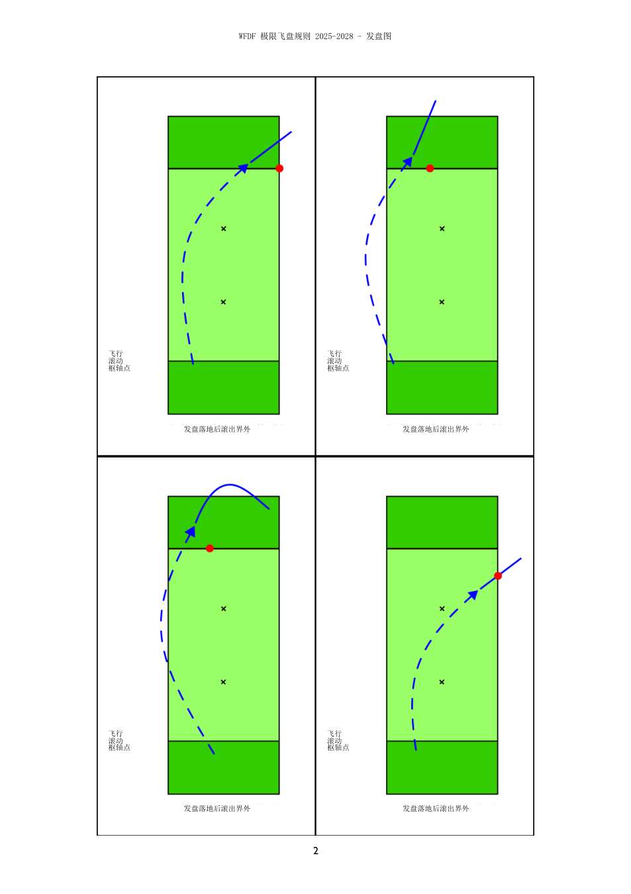
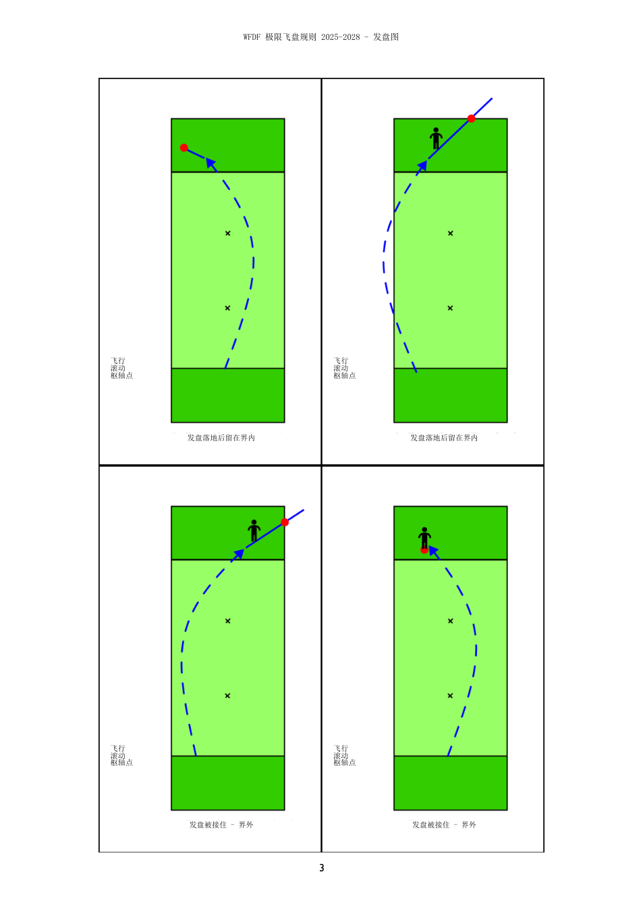
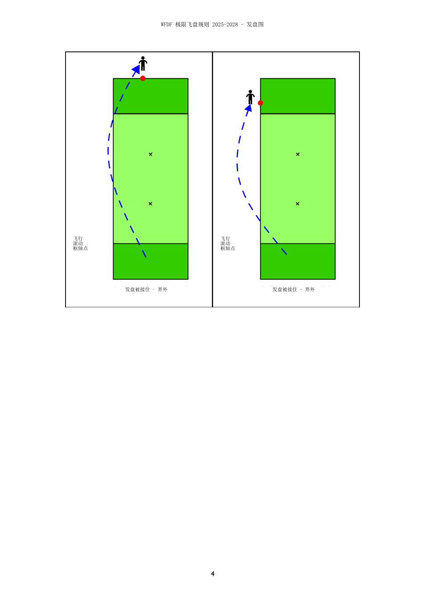

# WFDF 极限飞盘规则 2025-2028 - 发盘图（中文转写）

> 本文件是网页中文图示的可维护 Markdown 源稿。网页构建直接使用其中的本地 PNG 素材。

## 图 1：发盘直接落界外

发盘未先落在比赛场地时，后方或侧方出界的可选枢轴位置示例。

## 图 2：发盘落地后滚出界外

飞盘先落地后滚出界外时，按首次越过边界线的位置继续。

## 图 3：发盘留在界内或被界内接住

展示发盘落地后留在界内、触碰后滚出界外，以及被界内接住时的典型枢轴位置。

## 图 4：界外接住发盘

进攻方在界外接住发盘的其余典型情况。

